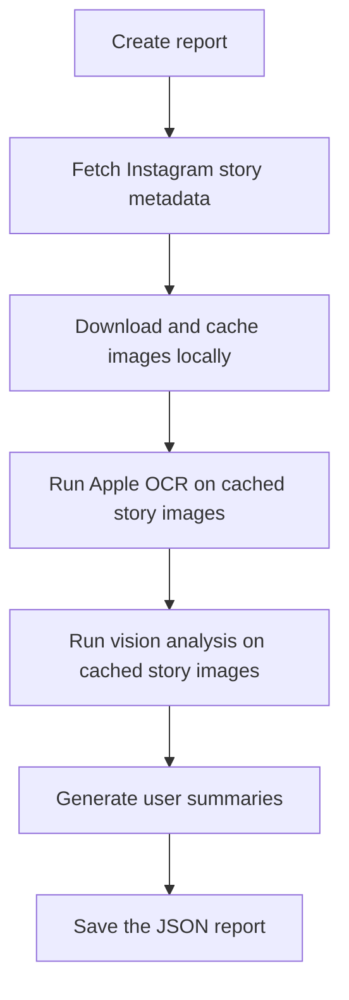

# Slopstagram

## Prerequisites

Install [Bun](https://bun.sh/) 1.3.14 or newer.

Install [Ollama](https://ollama.com/)

Then install 2 models

```bash
ollama pull qwen3.5:0.8b-mlx
ollama pull minicpm-v4.6:latest
```

## Setup

```bash
bun install
```

Authenticate in a persistent Playwright session:

```bash
bun run auth
```

Complete the Instagram login in the opened browser, Then close the browser.

## Usage

Create report:

```bash
bun run create:report
```

### Report pipeline



View cached reports:

```bash
bun run start
```

Open <http://localhost:5173/>.
