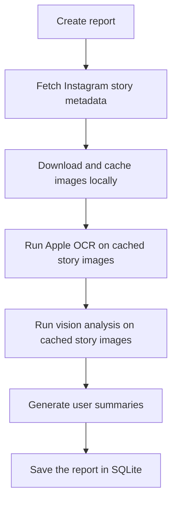

# Slopstagram

## Prerequisites

Install [Node.js](https://nodejs.org/) 24 or newer. The application runs on Node.js,
but its standalone [bunqueue](https://bunqueue.dev/) server still requires
[Bun](https://bun.sh/) 1.3.14 or newer.

Install [Ollama](https://ollama.com/).

Install the Chromium build used by Playwright:

```bash
npx playwright install chromium
```

Install the vision model on every platform:

```bash
ollama pull minicpm-v4.6:latest
```

Then install the user-summary model for your platform.

On an Apple Silicon Mac:

```bash
ollama pull qwen3.5:0.8b-mlx
```

On Windows, Linux, or an Intel Mac:

```bash
ollama pull qwen3.5:0.8b
```

The application selects the matching model automatically. The MLX variant is optimized for
Apple Silicon and is not available on Windows; the standard variant is the portable fallback.

## Setup

```bash
npm install
```

Authenticate in a persistent Playwright session:

```bash
npm run auth
```

Complete the Instagram login in the opened browser, Then close the browser.

## Usage

Create report:

```bash
npm run create:report
```

### Report pipeline



View reports:

```bash
npm run start
```

Open <http://localhost:5173/>.

## Development

Cached media, the SQLite databases, and the Playwright profile are stored in `./data`.
Database migrations are applied automatically when the Nitro server starts and before report
creation. After changing an entity schema, generate a migration with:

```bash
npm run db:generate
```

## Runtime rationale

The Nitro application and scripts run on Node.js. Bun is retained only for the
standalone bunqueue server. See [RATIONALE.md](./RATIONALE.md) for details.
